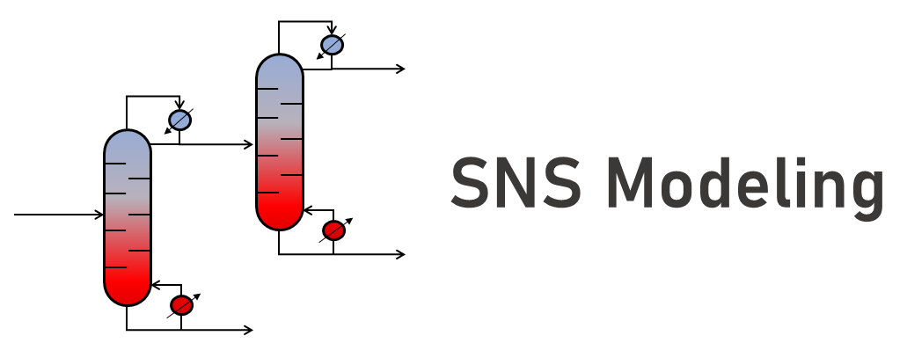

Repo contains modeling files for solving optimal separation network synthesis problems for zeotropic mixtures. Models are formualted in Pyomo using Pyomo.GDP and solved using BARON.

# Requirements
 
The requirements are listed in the requirements.txt file. To install them, run the following command in the terminal:

```python 
pip install -r requirements.txt
```

# Setup and install

Download or clone the package from the Github repo [sns_modeling](https://github.com/pfauk/sns_modeling). In a terminal, navigate to the directory location and install the package by running: 

```
pip install -e . 
```

**Important**: this package requires an installed version of Gurobi to solve the MIQCP model. It is possible to pip install Gurobi from the Python Package Index (PyPI). However, the free version comes with a trial license that will only be able to solve models of a smaller size (2,000 variables or constraints).


# Problem Data

Data for a specific problems can be entered into Excel sheets. The ```src/data``` directory contains example sheets of how to structure the input data.


# Solving Model and Viewing Output

The optimization model is built and and solved in ```main.py``` script in ```src/thermal_coupled``` directory. Users must specify the number of componenets in the system and the name of the data file. Navigate to ```src/thermal_coupled``` directory and run:

```python 
python main.py
```

Users can specfiy a file name and directory to save the Pyomo model to with ```save_model_to_file()``` and can save the solution output by specifying a file name and directory with ```save_solution_to_file()```. Default directories for saved models and solutions are ```src/thermal_coupled/saved_models``` and ```src/thermal_coupled/results```